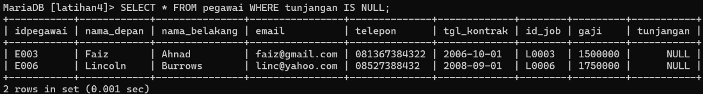

# Tugas Praktikum { Pertemuan ke 11 } 


|**Nama**|**NIM**|**Kelas**|**Matkul**|
|----|---|-----|------|
|Wioreta Vebra Azhari Leander|312310567|TI.23.A.5|Basis Data|

# Soal Latihan Praktikum ( Pegawai )


**Perintah SQL :**

```
CREATE TABLE pegawai (
    idpegawai VARCHAR(5) PRIMARY KEY,
    nama_depan VARCHAR(10) NOT NULL,
    nama_belakang VARCHAR(15) NOT NULL,
    email VARCHAR(25) UNIQUE KEY,
    telepon VARCHAR(15),
    tgl_kontrak DATA,
    id_job VARCHAR(5),
    gaji INT,
    tunjangan INT
    );

INSERT INTO pegawai VALUES
    ('E001', 'Ferry', 'Gustiawan', 'ferry@yahoo.com', '07117059004', '2005-09-01', 'L0001', 2000000, 500000),
	('E002', 'Aris', 'Ganiardi', 'aris@yahoo.com', '081312345678', '2006-09-01', 'L0002', 2000000, 200000),
	('E003', 'Faiz', 'Ahnad', 'faiz@gmail.com', '081367384322', '2006-10-01', 'L0003', 1500000, NULL),
	('E004', 'Emna', 'Bunton', 'emna@gmail.com', '081363484342', '2006-10-01', 'L0004', 1500000, 9),
	('E005', 'Mike', 'Scoff', 'mike@plasa.com', '08163454555', '2007-09-01', 'L0005', 1250000, 9),
	('E006', 'Lincoln', 'Burrows', 'linc@yahoo.com', '08527388432', '2008-09-01', 'L0006', 1750000, NULL);
```

***Output :***


## Tugas Praktikum

**1. Tampilkan pegawai yang gajinya bukan 2.000.000 dan 1.250.000 !**

```
SELECT*FROM pegawai WHERE gaji NOT IN (2000000, 1250000);
```

***Output :***


**2. Tampilkan pegawai yang tunjangannya NULL!**

```
SELECT*FROM pegawai WHERE tunjangan IS NULL;
```

***Output :***



**3. Tampilkan pegawai yang tunjangannya tidak NULL!**

```
SELECT*FROM pegawai WHERE tunjangan IS NOT NULL;
```

***Output :***


**4. Tampilkan/hitung jumlah baris/record tabel pegawai!**

```
SELECT COUNT(*) AS jmlh_pegawai FROM pegawai;
```

***Output :***


**5. Tampilkan/hitung jumlah total gaji di tabel pegawai!**

```
SELECT SUM(gaji) AS ttl_gaji FROM pegawai;
```

***Output :***


**6. Tampilkan/hitung rata-rata gaji pegawai!**

```
SELECT AVG(gaji) AS mean_gaji FROM pegawai;
```

***Output :***


**7. Tampilkan gaji terkecil!**

```
SELECT MIN(gaji) AS terkecil FROM pegawai;
```

***Output :***


**8. Tampilkan gaji terbesar!**

```
SELECT MAX(gaji) AS terbesar FROM pegawai;
```

***Output :***


# Soal Latihan Praktikum ( Hewan )


**Perintah SQL :**

```
CREATE TABLE hewan (
    id VARCHAR (5) PRIMARY KEY,
    name VARCHAR (10) NOT NULL,
    owner VARCHAR (10),
    species VARCHAR (10),
    sex enum('M', 'F')
    );

INSERT INTO hewan VALUES
    ('p1', 'Puffball', 'Diane', 'Hamster', 'F'),
    ('p2', 'Claws', 'Gwen', 'Cat', 'M'),
    ('p3', 'Fluffy', 'Haro 1d', 'Cat', 'F'),
    ('p4', 'Buffy', 'Haro 1d', 'Dog', 'F'),
    ('p5', 'Fang', 'Benny', 'Dog', 'M'),
    ('p6', 'Bowser', 'Diane', 'Dog', 'M'),
    ('p7', 'Chirpy', 'Gwen', 'Bird', 'F'),
    ('p8', 'Whistler', 'Gwen', 'Bird', NULL),
    ('p9', 'Slim', 'Benny', 'Snake', 'M');
```

***Output :***


## Tugas Praktikum

**1. Tampilkan jumlah hewan yang dimiliki setiap owner.**

```
SELECT owner, COUNT(*) AS jmlh_hewan FROM hewan GROUP BY owner;
```

***Output :***


**2. Tampilkan jumlah hewan berdasarkan spesies**

```
SELECT species, COUNT(*) AS jmlh_hewan FROM hewan GROUP BY species;
```

***Output :***


**3. Tampilkan jumlah hewan berdasarkan jenis kelamin**

```
SELECT sex, COUNT(*) AS jmlh_hewan FROM hewan GROUP BY sex;
```

***Output :***


**4. Tampilkan jumlah hewan berdasarkan spesies dan jenis kelamin**

```
SELECT species, sex, COUNT(*) AS jumlah_hewan FROM hewan GROUP BY species, sex;
```

***Output :***


**5. Tampilkan jumlah hewan berdasarkan spesis (cat dan dog saja) dan jenis kelamin**

```
SELECT species, sex, COUNT(*) AS jumlah_hewan FROM hewan WHERE
species IN ('Cat', 'Dog')
GROUP BY species, sex;
```

***Output :***


**6. Tampilkan jumlah hewan berdasarkan jenis kelamin yang diketahui saja**

```
SELECT sex, COUNT(*) AS jumlah_hewan FROM hewan WHERE sex IS NOT NULL GROUP BY sex;
```

***Output :***


## Tulis semua perintah-perintah SQL percobaan di atas beserta outputnya!

```
CREATE DATABASE praktikum4;
USE praktikum4;
CREATE TABLE pegawai (
    idpegawai VARCHAR (5) PRIMARY KEY,
    nama_depan VARCHAR (10) NOT NULL,
    nama_belakang VARCHAR (15) NOT NULL,
    email VARCHAR (25) UNIQUE KEY,
    telepon VARCHAR (15),
    tgl_kontrak DATE,
    id_job VARCHAR (5),
    gaji INT,
    tunjangan INT
    );

INSERT INTO pegawai VALUES
    ('E001', 'Ferry', 'Gustiawan', 'ferry@yahoo.com', '07117059004', '2005-09-01', 'L0001', 2000000, 500000),
	('E002', 'Aris', 'Ganiardi', 'aris@yahoo.com', '081312345678', '2006-09-01', 'L0002', 2000000, 200000),
	('E003', 'Faiz', 'Ahnad', 'faiz@gmail.com', '081367384322', '2006-10-01', 'L0003', 1500000, NULL),
	('E004', 'Emna', 'Bunton', 'emna@gmail.com', '081363484342', '2006-10-01', 'L0004', 1500000, 9),
	('E005', 'Mike', 'Scoff', 'mike@plasa.com', '08163454555', '2007-09-01', 'L0005', 1250000, 9),
	('E006', 'Lincoln', 'Burrows', 'linc@yahoo.com', '08527388432', '2008-09-01', 'L0006', 1750000, NULL);

SELECT * FROM pegawai;

SELECT * FROM pegawai WHERE gaji NOT IN (2000000, 1250000);

SELECT * FROM pegawai WHERE tunjangan IS NULL;

SELECT * FROM pegawai WHERE tunjangan IS NOT NULL;

SELECT COUNT(*) AS jumlah_pegawai FROM pegawai;

SELECT SUM(gaji) AS total_gaji FROM pegawai;

SELECT AVG(gaji) AS rata_rata_gaji FROM pegawai;

SELECT MIN(gaji) AS gaji_terkecil FROM pegawai;

SELECT MAX(gaji) AS gaji_terbesar FROM pegawai;

CREATE TABLE hewan (
    id VARCHAR (5) PRIMARY KEY,
    name VARCHAR (10) NOT NULL,
    owner VARCHAR (10),
    species VARCHAR (10),
    sex enum('M', 'F')
    );

INSERT INTO hewan (id, name, owner, species, sex)
VALUES ('p1', 'Puffball', 'Diane', 'Hamster', 'F'),
       ('p2', 'Claws', 'Gwen', 'Cat', 'M'),
       ('p3', 'Fluffy', 'Haro 1d', 'Cat', 'F'),
       ('p4', 'Buffy', 'Haro 1d', 'Dog', 'F'),
       ('p5', 'Fang', 'Benny', 'Dog', 'M'),
       ('p6', 'Bowser', 'Diane', 'Dog', 'M'),
       ('p7', 'Chirpy', 'Gwen', 'Bird', 'F'),
       ('p8', 'Whistler', 'Gwen', 'Bird', NULL),
       ('p9', 'Slim', 'Benny', 'Snake', 'M');

SELECT * from hewan;

SELECT owner, COUNT(*) AS jumlah_hewan FROM hewan GROUP BY owner;

SELECT species, COUNT(*) AS jumlah_hewan FROM hewan GROUP BY species;

SELECT sex, COUNT(*) AS jumlah_hewan FROM hewan GROUP BY sex;

SELECT species, sex, COUNT(*) AS jumlah_hewan FROM hewan GROUP BY species, sex;

SELECT species, sex, COUNT(*) AS jumlah_hewan FROM hewan WHERE species IN ('Cat', 'Dog') GROUP BY species, sex;

SELECT sex, COUNT(*) AS jumlah_hewan FROM hewan WHERE sex IS NOT NULL GROUP BY sex;
```

## Berikan Kesimpulan Anda !

Terdapat beberapa ***Query Filter*** yang ditemukan pada tugas praktikum 4 :

- Operator `IN` digunakan untuk memfilter data yang terdapat pada list IN
- Operator `NOT IN` digunakan untuk memfilter data yang tidak terdapat pada list IN
- Operator `IS NULL` digunakan untuk menampilkan data dengan nilai data NULL
- Operator `IS NOT NULL` digunakan untuk menampilkan data dengan nilai data tidak NULL
- `COUNT` adalah perintah yang digunakan untuk menghitung jumlah baris suatu kolom pada tabel.
- `SUM` adalah perintah yang digunakan untuk menghitung jumlah nilai suatu kolom pada tabel.
- `AVG` adalah perintah yang digunakan untuk menghitung rata-rata dari nilai suatu kolom pada tabel.
- `MIN` adalah perintah yang digunakan untuk menampilkan nilai terkecil dari suatu kolom pada tabel.
- `MAX` adalah perintah yang digunakan untuk menampilkan nilai terbesar dari suatu kolom pada tabel.
- Klausa `GROUP BY` berfungsi untuk mengelompokkan data berdasarkan field tertentu.

## FINISH